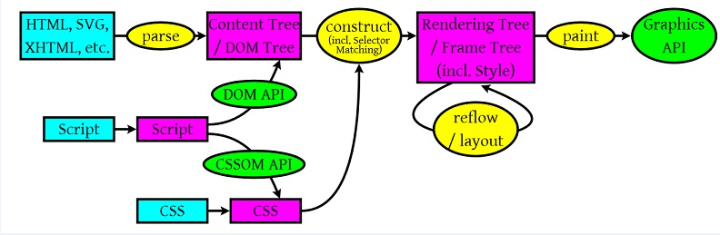

# 深入了解页面重绘与重排

## 浏览器运行机制


可能不同的浏览器略微会有些不同。但基本上都是类似的。

1. 浏览器把获取到的HTML代码解析成1个DOM树，HTML中的每个tag都是DOM树中的1个节点，根节点就是我们常用的document对象。DOM树里包含了所有HTML标签，包括display:none隐藏，还有用JS动态添加的元素等。

2. 浏览器把所有样式(用户定义的CSS和用户代理)解析成样式结构体，在解析的过程中会去掉浏览器不能识别的样式，比如IE会去掉-moz开头的样式，而FF会去掉_开头的样式。

3. DOM Tree 和样式结构体组合后构建render tree, render tree类似于DOM tree，但区别很大，render tree能识别样式，render tree中每个NODE都有自己的style，而且 render tree不包含隐藏的节点 (比如display:none的节点，还有head节点)，因为这些节点不会用于呈现，而且不会影响呈现的，所以就不会包含到 render tree中。注意 visibility:hidden隐藏的元素还是会包含到 render tree中的，因为visibility:hidden 会影响布局(layout)，会占有空间。根据CSS2的标准，render tree中的每个节点都称为Box (Box dimensions)，理解页面元素为一个具有填充、边距、边框和位置的盒子。

4. 一旦render tree构建完毕后，浏览器就可以根据render tree来绘制页面了。

## 重绘与重排

1. 当render tree中的一部分(或全部)因为元素的规模尺寸，布局，隐藏等改变而需要重新构建。这就称为回流(reflow)。每个页面至少需要一次回流，就是在页面第一次加载的时候。在回流的时候，浏览器会使渲染树中受到影响的部分失效，并重新构造这部分渲染树，完成回流后，浏览器会重新绘制受影响的部分到屏幕中，该过程成为重绘。

2. 当render tree中的一些元素需要更新属性，而这些属性只是影响元素的外观，风格，而不会影响布局的，比如background-color。则就叫称为重绘。

**注意：重排必将引起重绘，而重绘不一定会引起重排。**


## 重排何时发生：

当页面布局和几何属性改变时就需要重排。下述情况会发生重排：

1. 添加或者删除可见的DOM元素；

2. 元素位置改变；

3. 元素尺寸改变——边距、填充、边框、宽度和高度

4. 内容改变——比如文本改变或者图片大小改变而引起的计算值宽度和高度改变；

5. 页面渲染初始化；

6. 浏览器窗口尺寸改变——resize事件发生时；

## 现代浏览器优化：渲染列队

**举个小例子**

比如我们想用js中修改一个div元素的样式

写下了以下代码

```
div.style.left = '10px';
div.style.top = '10px';
div.style.width = '20px';
div.style.height = '20px';
```
我们修改了元素的left、top、width、height属性

满足我们发生重排的条件

理论上会发生4次重排

但是实际上只会发生1次重排

这是因为我们现代的浏览器都有渲染队列的机制

当我改变了元素的一个样式会导致浏览器发生重排或重绘时

它会进入一个渲染队列

然后浏览器继续往下看，如果下面还有样式修改

那么同样入队

直到下面没有样式修改

浏览器会按照渲染队列批量执行来优化重排过程，一并修改样式

这样就把本该4次的重排优化为1次

**但是我们现在想要修改样式后在控制台打印**

```
div.style.left = '10px';
console.log(div.offsetLeft);
div.style.top = '10px';
console.log(div.offsetTop);
div.style.width = '20px';
console.log(div.offsetWidth);
div.style.height = '20px';
console.log(div.offsetHeight);
```
千万不要写这样的代码，因为发生了4次重排

有同学可能不懂了，不是说浏览器有渲染队列优化机制吗？

为什么这样写就会发生4次重排

因为offsetLeft/Top/Width/Height非常叼

它们会强制刷新队列要求样式修改任务立刻执行

想一想其实这么做是有道理的

毕竟浏览器不确定在接下来的代码中你是否还会修改同样的样式

为了保证获得正确的值，它不得不立刻执行渲染队列触发重排

**以下属性或方法会刷新渲染队列**

- offsetTop、offsetLeft、offsetWidth、offsetHeight
- clientTop、clientLeft、clientWidth、clientHeight
- scrollTop、scrollLeft、scrollWidth、scrollHeight
- getComputedStyle()（IE中currentStyle）

修改样式过程中，要尽量避免使用上面的属性

## 重绘与重排的性能优化

### 分离读写操作

了解了原理我们就可以对上面的代码进行优化

```
div.style.left = '10px';
div.style.top = '10px';
div.style.width = '20px';
div.style.height = '20px';
console.log(div.offsetLeft);
console.log(div.offsetTop);
console.log(div.offsetWidth);
console.log(div.offsetHeight);
```
这样就仅仅发生1次重排了，原因相信大家已经很清晰了

把所有的读操作移到所有写操作之后

效率高多了

这是其中一种优化的方法

### 样式集中改变

虽然现代浏览器有渲染队列的优化机制

但是古董浏览器效率仍然底下，触发了4次重排

即便这样，我们仍然可以做出优化

我们需要cssText属性合并所有样式改变

```
div.style.cssText = 'left:10px;top:10px;width:20px;height:20px;'
```
这样只需要修改DOM一次一并处理

仅仅触发了1次重排

而且只用了一行代码，看起来相对干净一些

不过有一点要注意，cssText会覆盖已有的行间样式

如果想保留原有行间样式，这样做

```
div.style.cssText += ';left:10px;';
```

除了cssText以外，我们还可以通过修改class类名来进行样式修改

```
div.className = 'new-class';
```
这种办法可维护性好，还可以帮助我们免除显示性代码

（有一点点性能影响，改变class需要检查级联样式，不过瑕不掩瑜）

### 缓存布局信息

缓存真是万金油，哪种性能优化都少不了它

```
div.style.left = div.offsetLeft + 1 + 'px';
div.style.top = div.offsetTop + 1 + 'px';
```
这种读操作完就执行写操作造成了2次重排；

**缓存可以进行优化**

```
var curLeft = div.offsetLeft;
var curTop = div.offsetTop;
div.style.left = curLeft + 1 + 'px';
div.style.top = curTop + 1 + 'px';
```
这也相当于是分离读写操作了，优化为1次重排

### 元素批量修改

现在我们想要向ul中循环添加大量li

（如果ul还不存在，最好的办法是先循环添加li到ul，然后再把ul添加到文档，1次重排）

这样做能减少重绘和重排的原理是

- 元素脱离文档
- 改变样式
- 元素回归文档

### 小结

```
我们要减少重绘和重排就是要减少对渲染树的操作，则我们可以合并多次的DOM和样式的修改。并减少对style样式的请求。
```
- 直接改变元素的className

- display：none；先设置元素为display：none；然后进行页面布局等操作；设置完成后将元素设置为display：block；这样的话就只引发两次重绘和重排；

- 不要经常访问浏览器的flush队列属性；如果一定要访问，可以利用缓存。将访问的值存储起来，接下来使用就不会再引发回流；

- 使用cloneNode(true or false) 和 replaceChild 技术，引发一次回流和重绘；

- 将需要多次重排的元素，position属性设为absolute或fixed，元素脱离了文档流，它的变化不会影响到其他元素；

- 如果需要创建多个DOM节点，可以使用DocumentFragment创建完后一次性的加入document；


```
var fragment = document.createDocumentFragment();

var li = document.createElement('li');
li.innerHTML = 'apple';
fragment.appendChild(li);

var li = document.createElement('li');
li.innerHTML = 'watermelon';
fragment.appendChild(li);

document.getElementById('fruit').appendChild(fragment);
```


- 尽量不要使用table布局。
