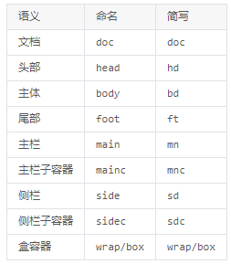
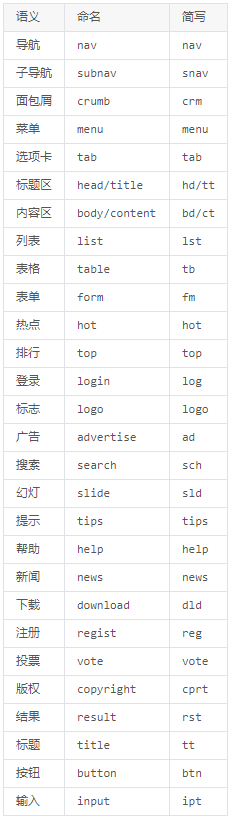
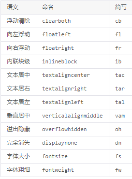
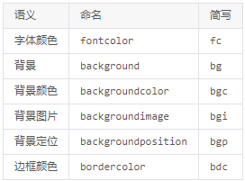
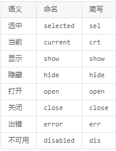

## 命名规则

1. 分类的命名方法：使用单个字母+"-"为前缀
* 布局（grid）（.g-）
* 模块（module）（.m-）
* 组件（component）（.c-）
* 元件（unit）（.u-）
* 功能（function）（.f-）
* 皮肤（skin）（.s-）
* 状态（.z-）

对以上的解释详情参见：分类方法中的“CSS内部的命名分类及其顺序”。

注：在你样式中的选择器总是要以上面前五类开头，然后在里面使用后代选择器。

　　如果这五类不能满足你的需求，你可以另外定义一个或多个大类，但必须符合单个字母+"-"为前缀的命名规则，即 .x- 的格式。

特殊：.j-将被专用于JS获取节点，请勿使用.j-定义样式。
```css
/* 布局 */
.g-hd {}
.g-bd {}
.g-side {}

/* 模块 & 组件 & 元件 */
.m-list {}
.c-table {}
.u-input {}
```

2. 后代选择器命名
```
/* 这里的.itm和.cnt只在.m-list中有效 */
.m-list{margin:0;padding:0;}
.m-list .itm{margin:1px;padding:1px;}
.m-list .cnt{margin-left:100px;}

/* 这里的.cnt和.num只在.m-page中有效 */
.m-page{height:20px;}
.m-page .cnt{text-align:center;}
.m-page .num{border:1px solid #ddd;}
```
注：后代选择器不要在页面布局中使用，因为污染的可能性较大,例如： .num

3. 命名应简约而不失语义
```
/* bad */
.m-abc .green2{}
.g-left2{}

/* good */
.m-list .wrap2{}
.g-side2{}
```

4. 模块和元件的扩展类的命名方法
* 当A、B、C、...它们类型相同且外形相似区别不大，那么就以它们中出现率最高的做成基类，其他做成基类的扩展。方法：+“-”+数字或字母（如：.m-list的扩展类为.m-list-1、.m-list-2等）。
* 如果你的扩展类是表示不同状态，那么你可以这样命名：u-btn-dis，u-btn-hov，m-box-sel，m-box-hov等等，然后像这样使用：class="u-btn u-btn-dis"。

## 最佳实践

1. 最佳选择器写法（模块）
```
/* 这是某个模块 */
.m-nav{}/* 模块容器 */
.m-nav li,.m-nav a{}/* 先共性  优化组合 */
.m-nav li{}/* 后个性  语义化标签选择器 */
.m-nav a{}/* 后个性中的共性 按结构顺序 */
.m-nav a.a1{}/* 后个性中的个性 */
.m-nav a.a2{}/* 后个性中的个性 */
.m-nav .z-crt a{}/* 交互状态变化 */
.m-nav .z-crt a.a1{}
.m-nav .z-crt a.a2{}
.m-nav .btn{}/* 典型后代选择器 */
.m-nav .btn-1{}/* 典型后代选择器扩展 */
.m-nav .btn-dis{}/* 典型后代选择器扩展（状态） */
.m-nav .btn.z-dis{}/* 作用同上，请二选一（如果可以不兼容IE6时使用） */
.m-nav .m-sch{}/* 控制内部其他模块位置 */
.m-nav .u-sel{}/* 控制内部其他元件位置 */
.m-nav-1{}/* 模块扩展 */
.m-nav-1 li{}
.m-nav-dis{}/* 模块扩展（状态） */
```
2. 统一语义理解和命名
* 布局（.g-）


* 模块（.m-）、元件（.u-）



* 功能（.f-）



* 皮肤（.s-）



* 状态（.z-）


